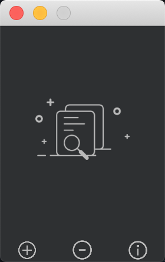
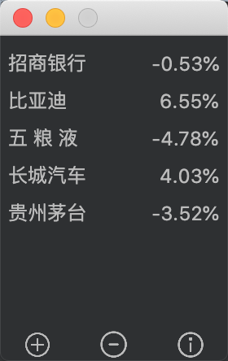
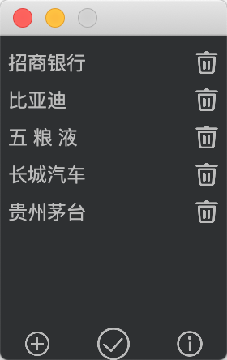

# 简述

基于Flutter2.2.0框架开发一款兼容Windows、macOS桌面股票看盘小工具，方便关注股票的涨跌幅，仅供学习Flutter使用。

## Getting Started

This project is a starting point for a Flutter application.

A few resources to get you started if this is your first Flutter project:

- [Lab: Write your first Flutter app](https://flutter.dev/docs/get-started/codelab)
- [Cookbook: Useful Flutter samples](https://flutter.dev/docs/cookbook)

For help getting started with Flutter, view our
[online documentation](https://flutter.dev/docs), which offers tutorials,
samples, guidance on mobile development, and a full API reference.

##设置桌面支持
* https://flutter.cn/desktop#add-desktop-support-to-an-existing-flutter-app

## 安装包下载地址
* macOS版：https://github.com/ChessLuo/flutter_stock_tool/releases/download/v1.0.0/stock_macos_v1.0.0.zip
* Windows版：https://github.com/ChessLuo/flutter_stock_tool/releases/download/v1.0.0/stock_windows_v1.0.0.zip

## 样式效果演示
|空主页|空搜索|主页列表|
|:---:|:---:|:---:|
||||
|删除列表|关于||
|:---:|:---:|:---:|
|||

   
## 版本历史：
###  v1.0.0 (2021/06/07)
* 版本初次提交，具备增删股票功能。

## 致谢
*感谢所有优秀的开源项目 ^_^ 。

## 其他
* 更多开源库请关注：[GitHub](https://github.com/ChessLuo)
* 最近建了公众号，欢迎大家关注，一起学习Android、小程序、跨平台开发~
* 